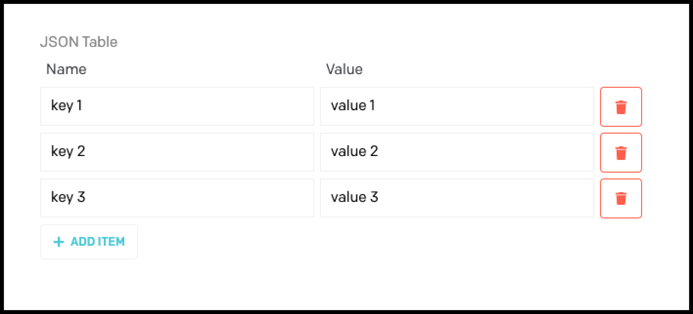
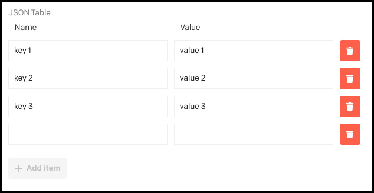
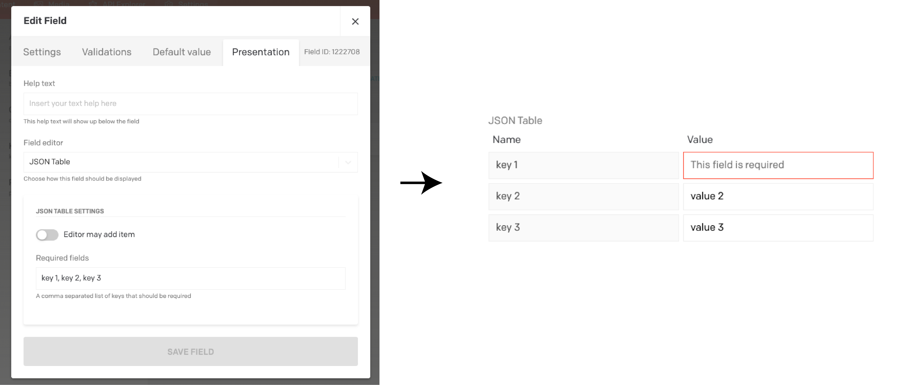

# DatoCMS plugin: JSON Table

**This DatoCMS plugin makes it possible to add/insert a key and value to output a simple JSON table. The plugin is build as a custom field editor for the DatoCMS JSON fields.**



When you input a key and value the output will be:
```json
{
  "key 1": "value 1",
  "key 2": "value 3",
  "key 3": "value 3"
}
```

## Features

* Add keys and values
* Output a simple JSON object
* Make individual entries mandatory
* Allow editor to add entries in the JSON table

For each entry in the JSON we show a key and value.



## Configuration

First add this plugin via DatoCMS Settings > Plugins > Add (`/admin/plugins/new`).

### Plugin settings

#### Settings

There are two settings for configuration of the JSON table.

If the `Editor may add item` (Default: `true`), the button with `+ ADD ITEM` will be shown. If this button is set to `false`, the editor will not be able to add any items.

`Required fields` is a comma seperated list of items that should be required. When an item is added to this list it will show automatically as an entry in the JSON table.



#### Default values

To give keys a default value you can use the `Default value` tab of the JSON field. Inserting:
```json
{
  "key 1": "value 1",
  "key 2": "value 3",
  "key 3": "value 3"
}
```
will result in having the same keys and values as default.


Adding the same keys to the `Required fields` will result in having default values for required fields where the editor is only allowed to edit values and not allowed to edit keys.

## Contributing

See [contributing.md](contributing.md).

## Credits

Scaffolded using [DatoCMS plugin Yeoman generator](https://github.com/datocms/generator-datocms-plugin).

## License

[MIT Licensed](license) by [De Voorhoede](https://www.voorhoede.nl).
